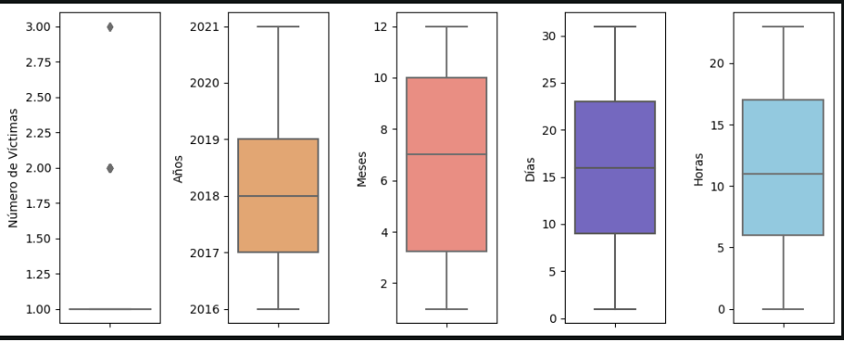
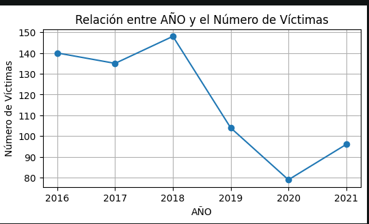
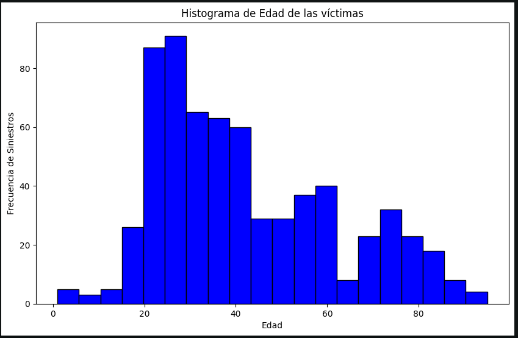
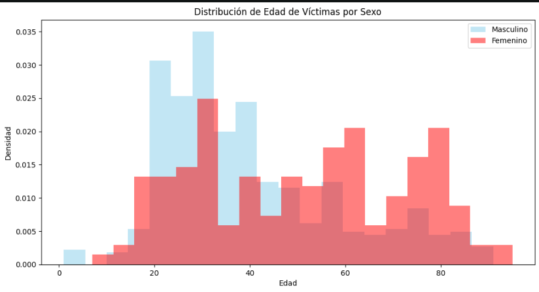
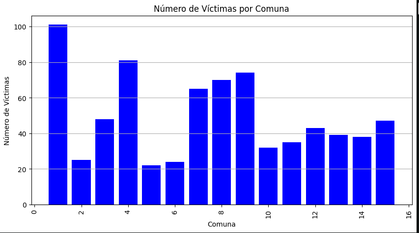
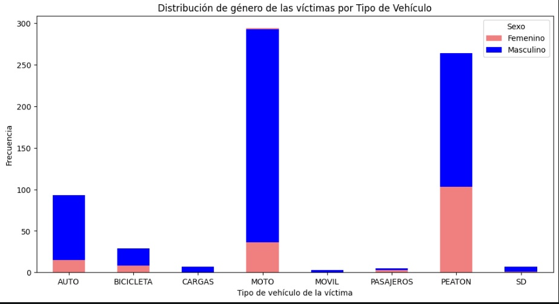

<!-- TABLA DE CONTENIDO -->

  
Tabla de contenido

  <ol>  
    <li><a href="#Introducción">Introducción</a></li>
    <li><a href="#Objetivo">Objetivo</a></li>
    <li><a href="#ETL">ETL</a></li>
    <li><a href="EDA">EDA</a></li>
  </ol>

## Introducción

En la Ciudad de Buenos Aires como sucede en las grandes urbes, la seguridad vial constituye una preocupación constante. Lamentablemente, los siniestros viales son eventos frecuentes que impactan la vida de residentes y visitantes. Anualmente, miles de personas resultan víctimas de accidentes de tráfico, algunos de los cuales provocan lesiones graves o incluso tragedias fatales. La gravedad de este problema no solo afecta la salud y seguridad de las personas, sino que también impacta en la infraestructura vial y los servicios de emergencia.

En este contexto, surge nuestro proyecto individual, una iniciativa que busca emplear el potencial de los datos y el análisis para enfrentar el desafío de los siniestros viales en la Ciudad de Buenos Aires. En colaboración con el Observatorio de Movilidad y Seguridad Vial (OMSV), nos hemos propuesto analizar a fondo los incidentes de tráfico ocurridos en los últimos años. Nuestro objetivo es claro: generar información valiosa que capacite a las autoridades locales para tomar medidas efectivas y reducir la cantidad de víctimas fatales en estos incidentes.

## Objetivo

El objetivo del proyecto "Siniestros Viales" es abordar el problema de los accidentes de tráfico o siniestros viales en la Ciudad de Buenos Aires desde la perspectiva de un Data Analyst. El proyecto tiene como contexto el alto volumen de tráfico y la densidad poblacional en la ciudad, lo que aumenta la preocupación por la seguridad vial.

El rol a desarrollar en este proyecto implica colaborar con el Observatorio de Movilidad y Seguridad Vial (OMSV) bajo la órbita de la Secretaría de Transporte del Gobierno de la Ciudad Autónoma de Buenos Aires. El objetivo principal es analizar un conjunto de datos sobre homicidios en siniestros viales ocurridos en la Ciudad de Buenos Aires durante el período 2016-2021. A partir de este análisis, se busca generar información que permita a las autoridades locales tomar medidas efectivas para reducir la cantidad de víctimas fatales en siniestros viales.

El proyecto se divide en varias etapas, que incluyen un Análisis Exploratorio de Datos (EDA), la creación de un Dashboard interactivo, la medición y representación de KPIs relacionados con la seguridad vial, y la creación de un repositorio en GitHub que incluye un informe de análisis basado en los dashboards y los KPIs.

En resumen, el objetivo principal del proyecto es utilizar el análisis de datos para contribuir a la reducción de la cantidad de víctimas fatales en siniestros viales en la Ciudad de Buenos Aires, brindando información valiosa a las autoridades para la toma de decisiones en materia de seguridad vial.

## ETL

Durante la fase de transformación y limpieza de datos (ETL), se han aplicado una serie de pasos esenciales para garantizar la calidad y coherencia de los datos. Estas acciones buscan preparar el conjunto de datos de manera óptima para su análisis posterior y para ser usados en el dashboard.

**1. Eliminación de Duplicados y verificamos tipo de datos por cada tabla :** Para asegurar la unicidad de las filas en el conjunto de datos, se han eliminado los duplicados y verificando tipos de datos para cada tabla.

**2. Filtrado de Fechas Inválidas:** Se ha realizado un filtrado riguroso en la columna 'release_date' para identificar y cuantificar los valores atípicos que no cumplen con el formato aaaa-mm-dd. Esto proporciona una comprensión clara de la calidad de los datos y posibles problemas en las fechas de lanzamiento.

**3. Union de las tablas:** Como parte de la transformación se ha realizado la union de las tablas por medio de un inner para que se traiga la informacion completa y se pueda trabajar de manera mas optima.

**4. Gestión de Valores Nulos:** La columna que posee más datos nulos es la columna "Altura" la cual posee un 81.46% de datos faltantes. Por ésta razón se eliminó.

**5. Identificación de Outliers:** Para asegurar la integridad los datos, se han revisado cuidadosamente mediante la ordenación y filtrado de los primeros y últimos valores. Esta inspección visual permite identificar posibles outliers o valores incoherentes que podrían requerir tratamiento adicional para su corrección o eliminación.

**6. Eliminación de Registros Incoherentes:** La eliminación de registros incoherentes es una medida importante para mantener la calidad de los datos. En caso de encontrar registros con valores nulos en todas las columnas relevantes, se ha procedido a eliminarlos. Esto asegura que los análisis futuros se basen en datos confiables y coherentes.

**7. Creacion de nuevas columnas:** se crearon dos columnas nuevas llamadas semtestre y rango etario todo esto con el fin de poder realizar el kpis y un dashboard mas claro.

*Todas estas etapas se llevaron a cabo de manera local en **Visual Studio Code (VSCODE)**, empleando **Jupyter Notebook** como nuestro entorno principal. Para la implementación de cada paso, contamos con la potencia de **Python** como lenguaje de programación, respaldado por las versátiles bibliotecas **numpy y pandas**, que fueron fundamentales para la manipulación y transformación eficiente de los datos. Estas herramientas esenciales se combinaron hábilmente para crear un flujo de trabajo fluido y eficaz, permitiendo que el proyecto tomara forma de manera coherente y organizada.*

## EDA

Utilizando los datos resultantes del proceso ETL, se llevó a cabo un análisis exploratorio de datos (EDA) que desveló fascinantes perspectivas y patrones subyacentes. Para potenciar este análisis, se empleó la herramienta ProfileReport de la librería ydata_profiling, que permitió una inspección exhaustiva de todas las columnas. Este proceso enriquecedor no solo iluminó las características fundamentales de los datos, sino que también ofreció una visión detallada de cómo abordar cuestiones como valores faltantes, valores atípicos, etc.

** Verificación de Outliers:**

Los outliers con respecto al número de victimas es debido a que en la mayoría de los siniestros, la cantidad de victimas es de valor uno y en ésos casos puntuales, la cantidad e victimas fueron de 2 y 3. 

** Relación entre Año y el Número de Víctimas :**

Se observa que durante los años 2017 y 2018 se produjeron la mayor cantidad de victimas fatales. Asi mismo, después del 2018 hubo una pronunciada disminución de los siniestros llegando al punto más bajo en el año 2020, que seguramente fue debido al confinamiento que pordujo la pandemia del Covid19.

** Relación entre la Edad de las víctimas y la cantidad de siniestros viales:**

Observamos que el 75% de las víctimas fatales es menor que 57 años. La mediana se sitúa en los 42 años. También podemos concluir que la mayor cantiad de víctimas fatales se concentra entre los 20 a 40 años de edad.

**Distribución etaria según el Sexo:**

Con ayuda el histograma podemos observar que las victimas de sexo femenino poseen unos picos en las edades de 30, 60 y 80 años. 

Con respecto a los hombres, en contraste observamos que la mayoría de las víctimas están concentradas entre los 20 y 40 años de edad.

** Distribución de siniestros por comunas:**

Observamos que la distribución de las víctimas por comuna es bastante heterogénea. Sería necesario verificar más al detalle las comunas 1, 4, 7, 8 y 9 las cuales presentan los mayores registros de siniestros. Valdría la pena verificar si existe alguna zona de alta densidad vehicular que pueda influir en la accidentalidad.

KPIS

KPI 1: Reducción del 10% en la tasa de homicidios en siniestros viales en CABA en comparación con el semestre anterior

Este KPI se enfoca en medir la evolución de la tasa de homicidios en siniestros viales en la Ciudad Autónoma de Buenos Aires (CABA) en un período de varios años, comparando los dos últimos semestres. Análisis más detallado:

Tendencia general: La tendencia en este KPI varía año tras año. En algunos años, se logra una disminución significativa, mientras que en otros se observa un aumento en la tasa de homicidios en siniestros viales.

Año 2020: Se destaca un aumento significativo en la tasa de homicidios en el primer semestre (61.29%), pero una mejora en el segundo semestre (10%), lo que puede ser atribuible a factores específicos, como el impacto de la pandemia o medidas de seguridad vial.

Año 2021: Los datos parecen estar incompletos, ya que falta información para el segundo semestre. Esto puede dificultar una evaluación precisa del rendimiento en ese año.

Comparación entre semestres: En algunos casos, se logra la reducción deseada del 10% entre semestres, mientras que en otros no se alcanza.

Análisis de causas: Sería útil profundizar en las razones detrás de las variaciones en la tasa de homicidios en siniestros viales, como cambios en las políticas de seguridad vial, mejoras en la infraestructura vial, o la influencia de eventos externos como la pandemia.

** Distribucíon de víctimas según género y tipo de vehículo:**

Observamos que para ambos sexos, la mayoría de victimas viajaban en moto o eran peatones. La cantidad de victimas hombres es notoriamente mayor al de las mujeres.

KPI 2: Reducción del 7% en la cantidad de accidentes mortales de motociclistas en CABA en el último año en comparación con el año anterior

Este KPI se centra en evaluar la evolución de la cantidad de accidentes mortales de motociclistas en la Ciudad Autónoma de Buenos Aires (CABA) en un período de varios años, comparando los dos últimos años. Análisis más detallado:

Tendencia general: En este KPI, también se observa una variación año tras año, con fluctuaciones tanto positivas como negativas.

Año 2020: Destaca un aumento significativo del 64.29% en la cantidad de accidentes mortales de motociclistas, lo que podría requerir una atención inmediata para comprender las razones detrás de este aumento.

Año 2021: Al igual que en el KPI 1, faltan datos para el año 2021 en este KPI, lo que dificulta una evaluación precisa.

Comparación anual: La reducción del 7% en la cantidad de accidentes mortales de motociclistas es el objetivo, pero no siempre se logra. Por ejemplo, en el año 2019, se observa una disminución significativa del 44%.

Análisis de causas: Para entender las fluctuaciones en este KPI, sería importante analizar factores como las medidas de seguridad específicas para motociclistas, el aumento en la cantidad de motociclistas en la ciudad y la aplicación de políticas de tráfico.
